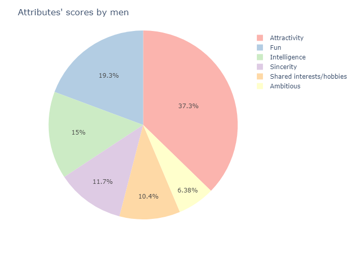
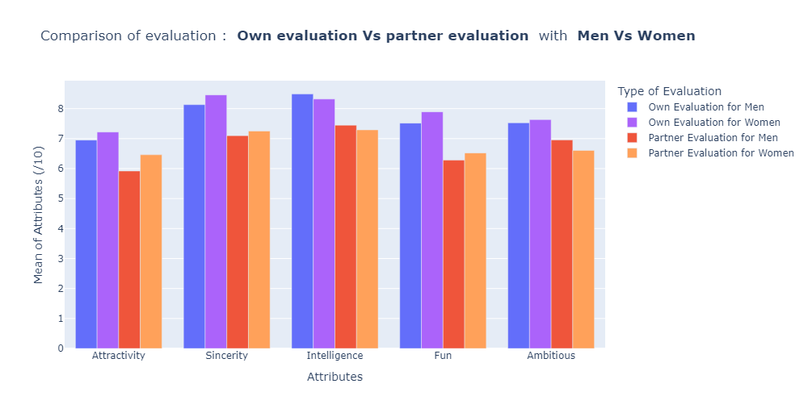
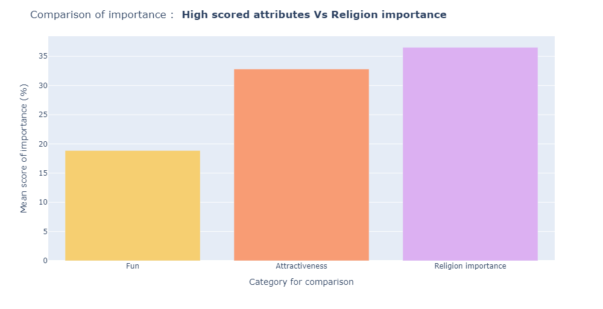
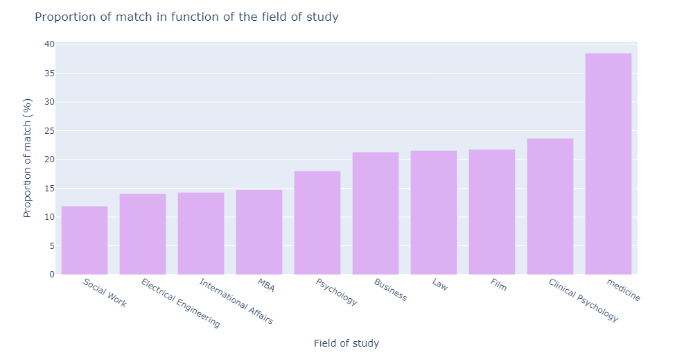

# SpeedDating Tinder Project

[](http://forthebadge.com) [](https://forthebadge.com)

This is an EDA project for the Jedha's certification.

## Getting Started

In this jupyter [Notebook](YP_Speed_Dating.ipynb), there will be the answers of the questions for this project; with the statistical description, visualisations and captions and interpretations; that will be the following (in the idea):

* What are the least desirable attributes in a male partner? Does this differ for female partners?
* How important do people think attractiveness is in potential mate selection vs. its real impact?
* Are shared interests more important than a shared racial background?
* Can people accurately predict their own perceived value in the dating market?
* The importance of the religion background
* The difference of match proportion in function of the field of study (and some hypotheses for why ?)

### Prerequisites

Things you need to run the codes:

```
python 3.12.1

pandas 
numpy
matplotlib
plotly
plotly.express
plotly.graph_objects
```

### Some results

Here some example of results:









To conclude and help the app tinder to make the good choice to propose people for a match that will continu on a second date, we observed the following points.

🌟 For both of gender, the more important attribute is the attractiveness, following by the fun of the partner. But everyone tends to have an higher own evaluation than what the partner evaluates. So without external help (like an AI object that can evaluates the attractiveness based on a photo and notes it for help the algorithm to propose people aroud the same note) it will be complicated. Maybe during the inscription, the app could ask more external informations to know what the person consider as attractive. One more thing, the attarctiveness importance is underestimated before to see people in real.

🌟 The shared racial background is pretty high. It is more important to have the same racial background than the same hobbies for the majority. So the algorithm should take this in count to propose the profile. And it should be indiquated during the profil creation.

🌟 In the same way, it is the same thing for religion. People are more able to have a match or accept multiple date if they have the same religion, which is link to the life philosophy of the person. So it should be considered in the profil creation and with the algorithm. It has be shown by the comparison with the 2 higher attributes condidered as important. The same religion background is higher in importance.

🌟 To finish the field of study/work count. It is also due to than it is linked to the person character, philosophy, mind, emotional intelligence... That's why medicine students have more match in proportion of their total number. So maybe the app should more condider theses characteristics in people, and engage people in this way and not just a human consomption. It is more durable and effecdtive.

## Acknowledgments

* Thanks for Jedha and its instructors for the lectures, exercises and all the work.

